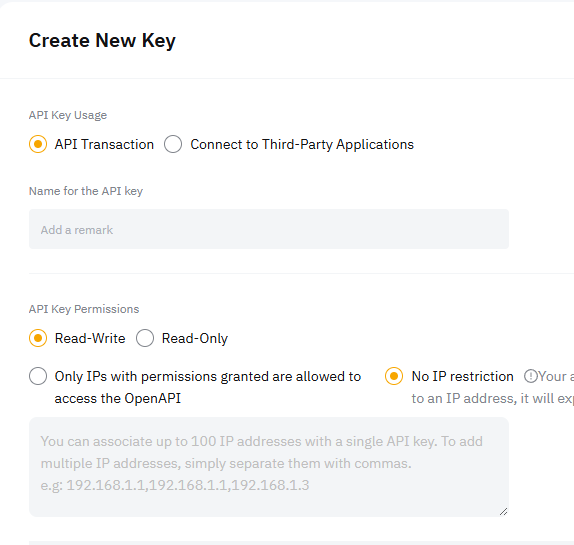
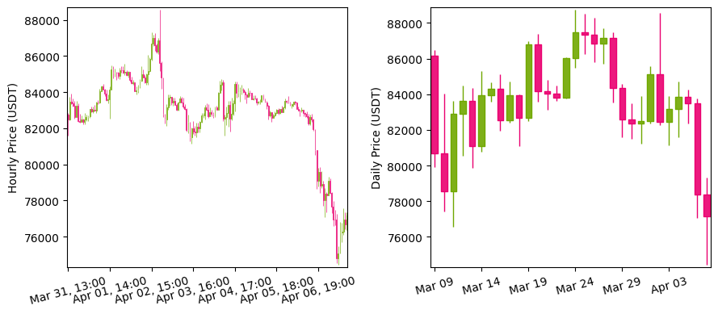
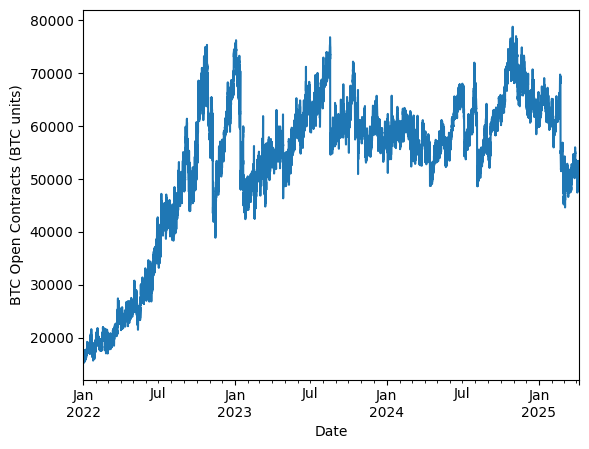

# 🚀 Bybit Python Tools Series

Welcome to the **Bybit Python Tools Series**.  

**Currently refactoring & updating a load of old posts — the new versions will be linked below.**  
**Feel free to look at older versions on the site, but just a heads up: they likely have bugs.**

Make sure to ⭐ star this repo and follow [codearmo.com](https://www.codearmo.com) for updates and open 
to suggestions for interesting topics to cover.

---

### ✅  Post 1: [Crypto Algo Trading 101: 🤖 Automating Strategies with Python](https://www.codearmo.com/python-tutorial/bybit-intro-algo-trading)

Get an introduction to algorithmic trading using Python.  
We explore what it means to automate crypto strategies, how Bybit’s API fits in,  
and lay the foundation for a scalable trading bot.

---

### ✅  Post 2: [First Steps in Algo Trading with Bybit & Python – Creating an API KEY](https://www.codearmo.com/python-tutorial/creating-api-key-bybit)

Guide for creating your Bybit API Key securely.

➡️ `part-1.ipynb`

---

### 📉 ✅  Post 3: [Crypto Data from Bybit: OHLC & Live Prices](https://www.codearmo.com/python-tutorial/getting-crypto-data-bybit)

- Pull candlestick data (OHLC), live tickers, and other market metrics from Bybit’s public API  
- Best way to get free crypto data  
- Resample OHLC from a lower time period to a higher one using `pandas.resample`

➡️ `part-2.ipynb`

---

### ✅  Post 4: [Crypto Data: Get Open Interest & Long-Short Ratio](https://www.codearmo.com/python-tutorial/crypto-data-get-open-interest-long-short-ratio)

Explore market sentiment metrics like Open Interest and the Long/Short Ratio.  
These tools help spot potential reversals and assess current trader positioning.

➡️ `part-3.ipynb`

---
